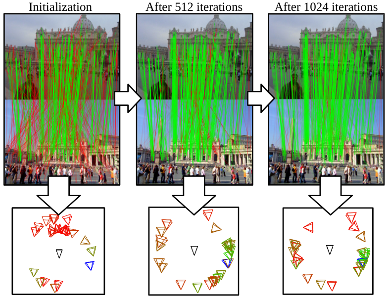

### RANSAC -- IMAGE STITCHING -- PROF SHREE NAYAR -- https://www.youtube.com/watch?v=EkYXjmiolBg&list=PL2zRqk16wsdp8KbDfHKvPYNGF2L-zQASc&index=5

<!-- ABOUT THE PROJECT -->
## Consensus Adaptive RANSAC



RANSAC and its variants are widely used for robust estimation, however, they commonly follow a greedy approach to finding the highest scoring model while ignoring other model hypotheses.
In contrast, Iteratively Reweighted Least Squares (IRLS) techniques gradually approach the model by iteratively updating the weight of each correspondence based on the residuals from previous iterations.
Inspired by these methods, we propose Consensus Adaptive RANSAC, a new RANSAC framework that learns to explore the parameter space by considering the residuals seen so far via a novel attention layer.
The attention mechanism operates on a batch of point-to-model residuals, and updates a per-point estimation state to take into account the consensus found through a lightweight one-step transformer. 
This rich state then guides the minimal sampling between iterations as well as the model refinement.

We evaluate the proposed approach on essential and fundamental matrix estimation on a number of indoor and outdoor datasets. 
It outperforms state-of-the-art estimators by a significant margin adding only a small runtime overhead.
Moreover, we demonstrate good generalization properties of our trained model, indicating its effectiveness across different datasets and tasks.
The proposed attention mechanism and one-step transformer provide an adaptive behavior that enhances the performance of RANSAC, making it a more effective tool for robust estimation.

This repository hosts the source code for Consensus-Adaptive RANSAC for reproducibility and use by the community. We provide pretrained models on the CVPR 2020 RANSAC Tutorial data and on a synthetic correspondence dataset, as well as the training script to train CA-RANSAC on a different dataset with direct pose supervision or just from correspondences, with self-supervision.


<!-- GETTING STARTED -->
## Usage

To try CA-RANSAC you can proceed as follows:

1. Create a minimal working conda environment with the required dependencies:
   ```
   conda create -n caransac python=3.8
   conda activate caransac
   conda install -c conda-forge -c numba pytorch-lightning numba h5py pybind11 fire tqdm tensorboard
   ```
2. Clone this repository and set the PYTHONPATH:
   ```
   git clone 'https://github.com/cavalli1234/CA-RANSAC'
   cd CA-RANSAC/source
   export PYTHONPATH=$PWD
   ```
3. Install [PoseLib](https://github.com/vlarsson/PoseLib) with python bindings in your environment
4. Run a test training on synthetic data:
   ```
   python example_train.py --dataset synthetic --checkpoint_out /tmp/caransac_synthetic
   ```

To train on RootSIFT mutual matches in phototourism, download the CVPR RANSAC Tutorial data [here](http://cmp.felk.cvut.cz/~mishkdmy/CVPR-RANSAC-Tutorial-2020/RANSAC-Tutorial-Data-EF.tar) and run:
   ```
   python example_train.py --checkpoint_in ../resources/models/caransac_synthetic.ckpt --checkpoint_out /tmp/caransac_photo --dataset phototourism --data_dir /path/to/extracted/data/RANSAC-Tutorial-Data/
   ```

The initial checkpoint is optional, but starting from the synthetic checkpoint will speed up convergence significantly.


The script we provide is just an example to re-train the model. However, it shows also how to use it for inference. You can use CA-RANSAC for inference by calling simply the forward method of the CA\_RANSAC class in ``models/arch.py`` with the documented interface. To train CA-RANSAC without ground truth pose, just call the method ``forward_with_losses`` without specifying any ground truth, it will automatically switch to self supervision.
